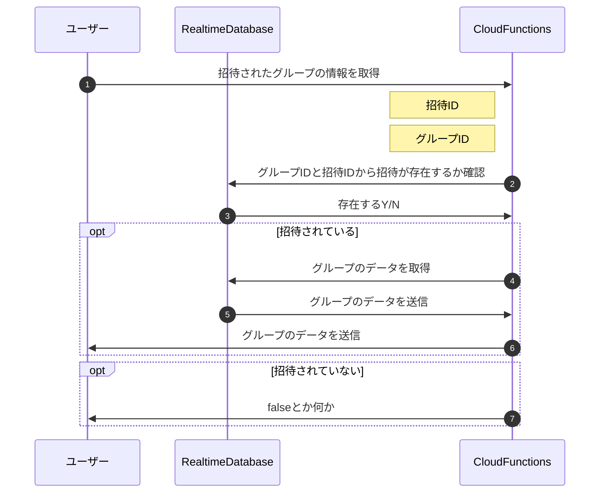

# Stask

多くの課題に追われる学生向けの課題管理アプリ

```mermaid
sequenceDiagram
    autonumber
    participant client as ユーザー
    participant db as RealtimeDatabase
    participant cloud as CloudFunctions
    
    client ->> cloud : 招待されたグループの情報を取得
    Note left of cloud: 招待ID
    Note left of cloud: グループID

    cloud ->> db : グループIDと招待IDから招待が存在するか確認
    db ->> cloud : 存在するY/N

    opt 招待されている
        cloud ->> db : グループのデータを取得
        db ->> cloud : グループのデータを送信

        cloud ->> client : グループのデータを送信
    end

    opt 招待されていない
        cloud ->> client : falseとか何か
    end
```